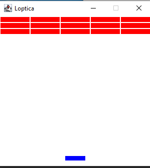
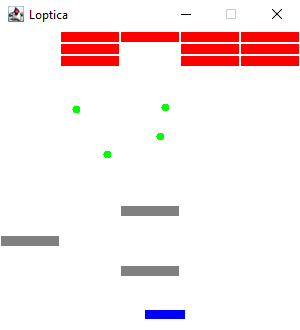

# 🎮 Java Mini Games

**Java Mini Games** is a collection of simple GUI-based games developed using Java Swing.  
This project was created as a school assignment in **May 2024**.  
*Note: source file names and comments are written in Serbian.*

## 📁 Project Structure

- `Balls/` – contains the brick-and-ball bouncing game
- `Snake/` – contains a classic snake game

---

## 🟡 Balls

### Description
The *Balls* game generates bouncing balls upon user clicks. Each ball gets a random direction and moves around, bouncing off bricks and walls. When a brick is hit, it turns gray and begins to fall.

### 📸 Screenshots

| Initial State | Gameplay |
|---------------|----------|
|  |  |

---

## 🐍 Snake

### Description
A classic snake game where the player controls a snake that grows in length by eating dots. The game can be restarted via a button, and ends if the snake collides with itself.

### 📸 Screenshots

| Initial State | New Game | Gameplay | Game Over |
|----------------|----------|-----------|-------------|
|  |  |  |  |

---

## ⚙️ Technologies Used

- Java
- Java AWT for GUI

---

## 📌 Note

This project was developed as a part of a school assignment in **May 2024**.  
File names and in-code comments are written in **Serbian**.

---

👤 Developed by **Mihailo Pantelić**
